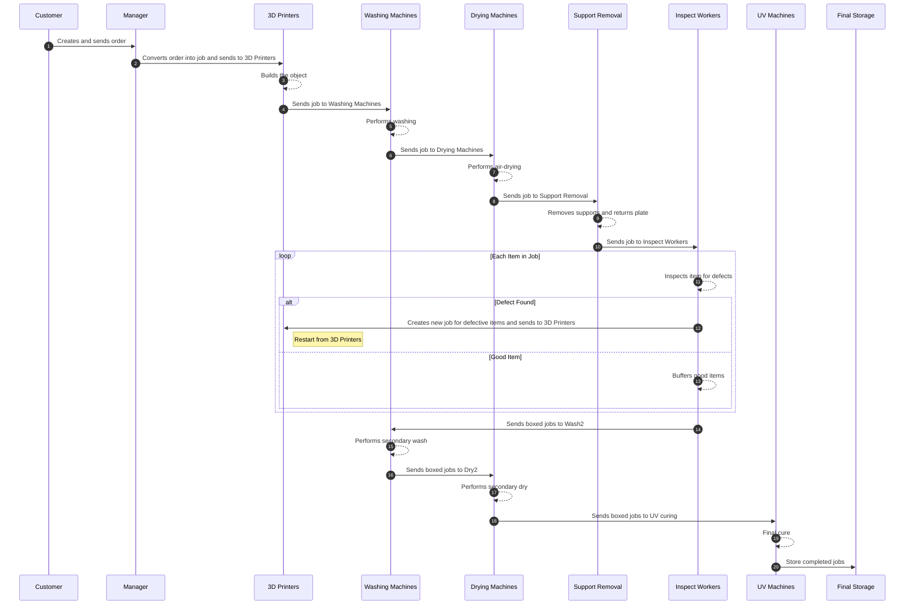

# SimPy based 3D Print Farm

## How to Run
### 1) Run the full simulation
```bash
cd src
python main_SimPy.py
```

### 2) Test only order generation
```bash
cd src
python main_Customer.py
```

### 3) Run the web simulator
```bash
cd src
python run_app.py
```
Open `http://127.0.0.1:8000` in a browser.

## Default Settings
Configuration lives in `src/config_SimPy.py`.
- Simulation time: `SIM_TIME`
- Machine counts/capacity: `NUM_MACHINES_*`, `CAPACITY_MACHINE_*`
- Process times: `PROC_TIME_*`
- Defect rate: `DEFECT_RATE_PROC_BUILD`
- Movement (AMR/manual): `MOVE_MODE`, `NUM_AMR`, `NUM_MANUAL_MOVERS`
- Order generation: `ORDER_ARRIVAL_MODE`, `ORDER_INTERVAL`, `ORDER_COUNT`
- Plate/box policies: `PALLET_SIZE_LIMIT`, `BOX_SIZE`, `POLICY_*`

When using the web UI, only the parameters whitelisted in `web_sim.py` can be overridden.

## File Roles
### Core logic
- `src/manager.py` : Orchestration, plates/AMR management, statistics
- `src/base_Process.py` : Base process (queueing, resource allocation, flow)
- `src/base_Processor.py` : Machine/Worker models and SimPy Resource wrapper
- `src/base_Job.py` : Job and JobStore definitions
- `src/specialized_Process.py` : Process-specific logic (Build/Wash/Dry/Inspect/UV)
- `src/specialized_Processor.py` : Machine/worker classes per process
- `src/base_Customer.py` : Customer/Order/Patient/Item models and order generation

### Execution and visualization
- `src/main_SimPy.py` : Full simulation entry point
- `src/main_Customer.py` : Order-generation test script
- `src/main_Process.py` : Basic process validation script
- `src/log_SimPy.py` : Logging, statistics, Gantt visualization
- `src/web_sim.py` : FastAPI web simulator
- `src/run_app.py` : Web server entry point
- `src/web_template.html` : Web UI template
- `src/viz_trace.py` : Simple animation trace generator

## Required Modules
Full set for `src/web_sim.py`:
- simpy
- fastapi
- uvicorn
- pydantic
- pandas
- numpy
- plotly

Install example:
```bash
pip install simpy fastapi uvicorn pydantic pandas numpy plotly
```

## Notes
- End-to-end process flow:
  Build -> Wash1 -> Dry1 -> SupportRemoval -> Inspect -> Wash2 -> Dry2 -> UV -> Final Storage
- SupportRemoval returns build plates to the stacker via the Manager and AMR
- Inspect consumes plate/rework jobs, creates box jobs from good items, and creates rework jobs for defects
- Wash2/Dry2/UV operate on boxed jobs only (post-inspection)
- AMR moves are handled by a global priority transport manager
- Statistics and Gantt charts are driven by `log_SimPy.py`

## Process Details (Post-Processing Included)
1) Build (Proc_Build)
   - Prints items on a build plate and assigns defect flags.
2) Wash1 (Proc_Wash1)
   - Primary wash for printed plates.
3) Dry1 (Proc_Dry1)
   - Primary dry for washed plates.
4) SupportRemoval (Proc_SupportRemoval)
   - Removes supports and returns the build plate to storage.
5) Inspect (Proc_Inspect)
   - Splits items into good/defect buffers.
   - Creates boxed jobs when enough good items accumulate.
   - Defects become rework jobs that re-enter Build.
6) Wash2 (Proc_Wash2)
   - Post-inspection wash for boxed items.
7) Dry2 (Proc_Dry2)
   - Post-inspection dry for boxed items.
8) UV (Proc_UV)
   - Final curing; finished jobs are stored in Manager.final_storage.

## Operation scenario

